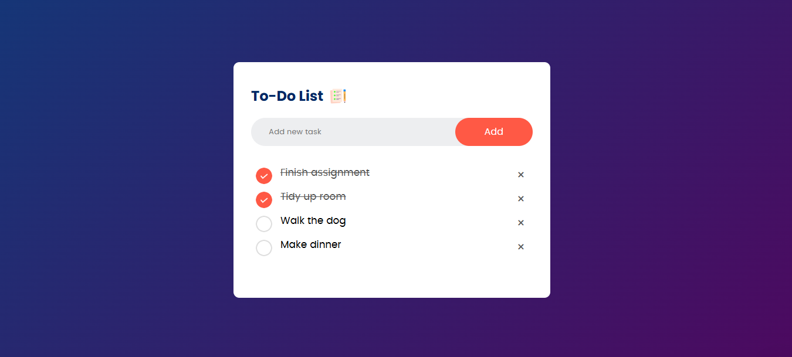

# To-Do List Application 📝



## Overview

This is a simple and elegant To-Do List application designed to help you efficiently manage your daily tasks. The clean and modern UI makes it easy to add, complete, and remove tasks, ensuring you stay organized and productive.

## Features

- **Add New Tasks:** Quickly add tasks to your to-do list using the input field and "Add" button.
- **Mark as Complete:** Click the circular checkbox to mark tasks as completed (displayed with a strikethrough).
- **Remove Tasks:** Easily delete tasks from your list by clicking the "×" button next to each task.
- **Responsive Design:** The interface adapts beautifully to different screen sizes and devices.

## Demo

https://roster-tracker.netlify.app/

## Getting Started

### Prerequisites

- Web browser (Chrome, Firefox, Edge, etc.)
- (Optional) Modern code editor such as VSCode

### Installation

1. **Clone the Repository:**
   ```bash
   git clone https://github.com/yourusername/todo-list-app.git
   ```
2. **Navigate to the Project Directory:**
   ```bash
   cd todo-list-app
   ```
3. **(If using a build tool or framework) Install Dependencies:**
   ```bash
   npm install
   ```
4. **Start the App:**
   - For static HTML/CSS/JS: Open `index.html` in your browser.
   - For frameworks (React/Vue/Angular): 
     ```bash
     npm start
     ```

## Usage

1. Enter a new task in the input field at the top.
2. Click the "Add" button to add the task to your list.
3. Click the circular checkbox to mark a task as complete/incomplete.
4. Click the "×" icon to remove a task from your list.

## Customization

- **Styling:** You can easily update the app's appearance by editing the CSS file.
- **Functionality:** Extend features such as task editing, persistent storage (localStorage/DB), or deadlines.

## Contributing

Contributions are welcome! Please open an issue or submit a pull request for improvements or suggestions.

## License

This project is open source and available under the [MIT License](LICENSE).

---

**Enjoy staying organized with your new To-Do List app!**
